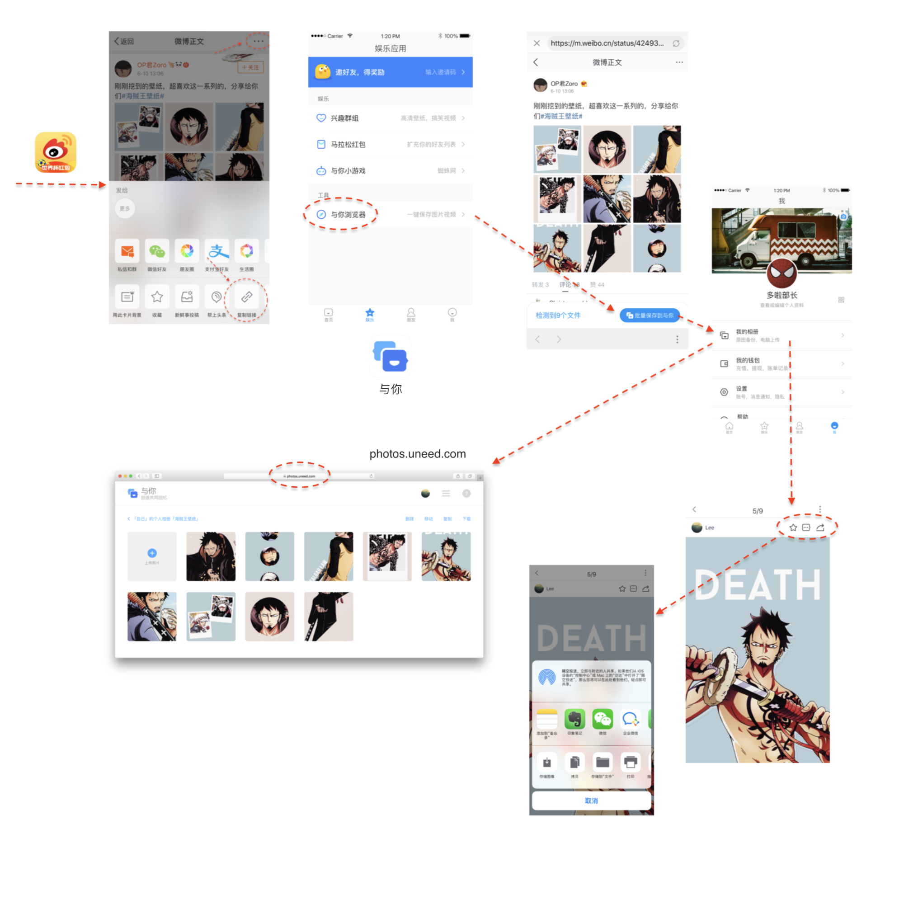

# 与你浏览器脚本

## 目的

在`与你App`中使用`与你浏览器`打开网页，通过注入相应的css和js，达到优化网页的排版和样式，提供下载资源到`与你相册`的功能。

## 原理

在`与你App`中使用`与你浏览器`打开任意网址时，客户端程序会自动向页面注入一个脚本（即`sites/inject.js`），这个脚本作用如下：

1. 分析域名，如：uneed.com
2. 注入css: cdn.uneed.com/browser/uneed.com/style.css
3. 注入 js: cdn.uneed.com/browser/uneed.com/script.js

## 如何参与开发

[参与开发](contributing.md)

## 相关下载

* 与你App：https://uneed.com

